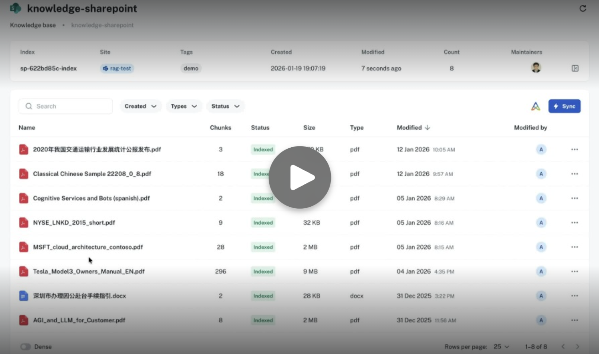

# Foundry IQ Tutorials

Hands-on notebooks for building and integrating Foundry IQ knowledge sources and agent services.

## Contents

- **01_foundry_iq_knowledge_base.ipynb**: Create and explore a Foundry IQ knowledge base.
- **02_foundry_agent_service_integration.ipynb**: Integrate Foundry IQ with an agent service.
- **03_knowledge_source_overview.ipynb**: Overview of knowledge source types.
- **03a_search_index_knowledge_sources.ipynb**: Search index knowledge source setup.
- **03b_blob_knowledge_source.ipynb**: Azure Blob knowledge source setup.
- **03c_web_knowledge_source.ipynb**: Web knowledge source setup.
- **03d_sharepoint_knowledge_source.ipynb**: SharePoint knowledge source setup.
- **03e_sharepoint_indexer.ipynb**: SharePoint indexing workflow.
- **03f_sharepoint_indexed_ks.ipynb**: SharePoint indexed knowledge source usage.
- **03g_sharepoint_remote_ks.ipynb**: SharePoint remote knowledge source usage.
- **03h_onelake_indexer.ipynb**: OneLake indexing workflow.

## Prerequisites

- Python 3.10+ (or a compatible environment for Jupyter).
- Jupyter Notebook or VS Code with the Jupyter extension.
- Access to Foundry IQ services and required Azure resources.

## Setup

1. Copy the environment template and fill in required values:
   - .env.example → .env
2. Start Jupyter and open notebooks in order.

## Suggested Run Order

Start with 01 and 02, then proceed through the 03* sequence.

## Data

The data used by the notebooks lives under the `data/` folder.

## Notes

These notebooks are intended for workshop use. Adjust resource names and credentials to match your environment.
