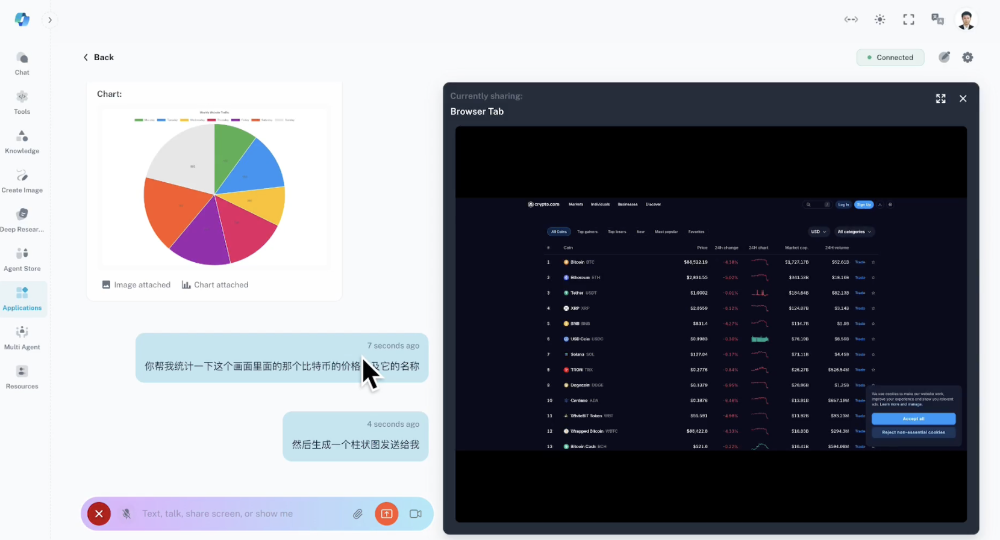

# Voice Live Notebooks

A small collection of Jupyter notebooks and helper scripts for building a voice-enabled RAG assistant and live function-calling demos.

## Contents

- 00_start.ipynb — project setup and basic sanity checks
- 01_phrase_list.ipynb — phrase list creation and preprocessing
- 02_custom_speech.ipynb — custom speech preparation and examples
- 03_rag_voice_assistant.ipynb — retrieval-augmented voice assistant workflow
- 04_voice_live_function_calling.ipynb — live function-calling demo
- audio_processor.py — audio preprocessing utilities
- rag_tools.py — RAG helper utilities
- rag_tools_redis.py — Redis-backed RAG utilities
- data/ — sample data and assets

## Requirements

- Python 3.10+ recommended
- Jupyter Lab or Notebook

Install dependencies (example):

- Create a virtual environment
- Install the packages required by the notebooks (see the first cell of each notebook for exact imports)

## How to run

1. Open the repository in VS Code.
2. Open a notebook and run cells top to bottom.
3. Follow any per-notebook instructions in the first markdown cell.

## Video demo

Watch the demo here: [Voice Live demo video](https://microsoftapc-my.sharepoint.com/:v:/g/personal/xle_microsoft_com/IQCk5MUBamDPSI9_nPe9SIZnAWgCQ19WOKkL6kQq3qSWP14?e=L6fytZ&nav=eyJyZWZlcnJhbEluZm8iOnsicmVmZXJyYWxBcHAiOiJTdHJlYW1XZWJBcHAiLCJyZWZlcnJhbFZpZXciOiJTaGFyZURpYWxvZy1MaW5rIiwicmVmZXJyYWxBcHBQbGF0Zm9ybSI6IldlYiIsInJlZmVycmFsTW9kZSI6InZpZXcifX0%3D)

## Notes

- Some notebooks may require API keys or service credentials. Create a local `.env` file or set environment variables as instructed in the notebooks.
- Do not commit secrets to git.

## License

Add your preferred license here (e.g., MIT).
