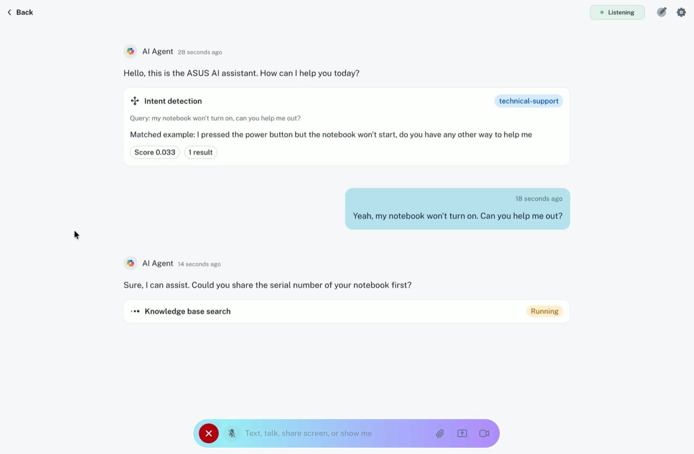
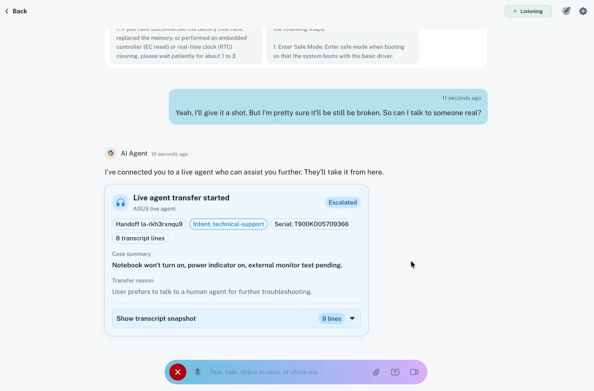
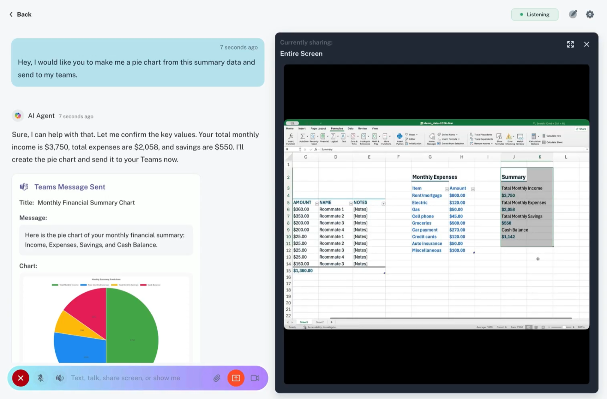

# realtime-multimodal-ai-assistant

This repository contains the frontend, backend, and integration samples that power the GBB AI application suite.

## Repository layout

- `backend`: aiohttp realtime backend for voice and websocket-based assistant flows.
- `frontend`: Vite/React frontend.
- `logic-app`: Azure Logic App sample for Teams webhook delivery used by the realtime backend.
- `docs`: shared supporting documentation for integrations and example prompts.

## Open-source notes

- Secrets have been removed from committed startup files.
- Example environment files are provided where backend services require local configuration.
- Customer-specific backend branding has been replaced with neutral Contoso branding.
- Review local `.env` files before publishing or sharing branches.

## Quick start

### Realtime backend

```bash
cd backend
python3 -m venv .venv
source .venv/bin/activate
pip install -r requirements.txt
cp .env.example .env
python app.py
```

The realtime backend serves the voice-first assistant and optional Teams integration through `TEAMS_WEBHOOK_URL`.

### Frontend

```bash
cd frontend
yarn install
yarn dev
```

If you prefer npm:

```bash
cd frontend
npm install
npm run dev
```

## Additional docs

- See [backend/README.md](backend/README.md) for realtime backend configuration and environment variables.
- See [logic-app/README.md](logic-app/README.md) for the Teams Logic App sample.
- See [docs/TEAMS_TOOL_README.md](docs/TEAMS_TOOL_README.md) and [docs/EXAMPLE_PROMPTS.md](docs/EXAMPLE_PROMPTS.md) for tool-level integration notes.

## Screenshots

### Intent and grounding



### Live agent transfer



### Screen sharing



## Notes

- The repo still contains some demo and mock data intended for development scenarios.
- Frontend and remaining product-specific assets can be cleaned separately.
